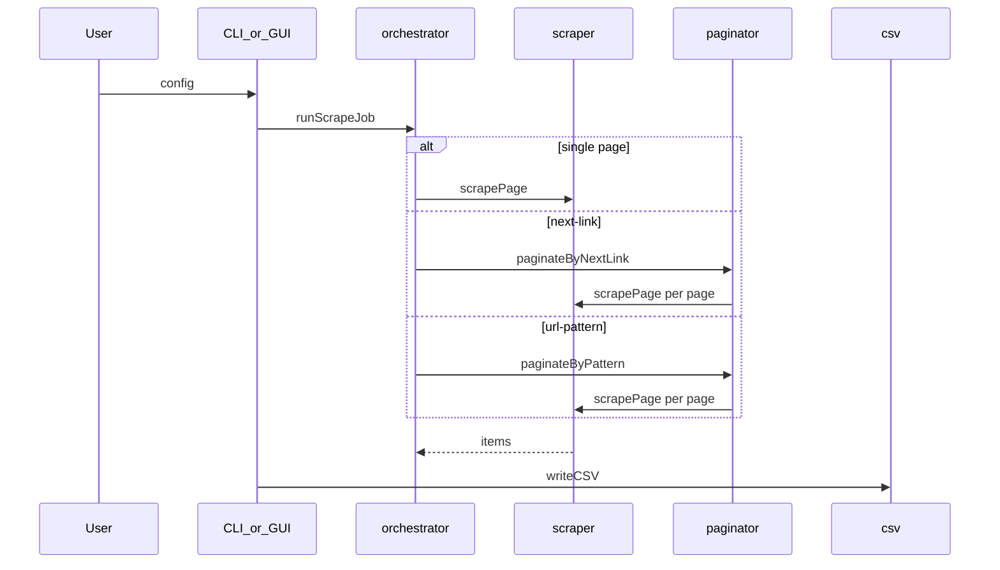

# Architecture

## Module map

| Path | Role |
| --- | --- |
| [`index.js`](../index.js) | CLI entry: argument parsing, dispatches to `cli/index.js`. |
| [`cli/`](../cli/) | Interactive prompts (Inquirer), preset resolution, CSV write. |
| [`src/orchestrator.js`](../src/orchestrator.js) | Single entry for scrape runs (CLI + GUI). |
| [`src/scraper.js`](../src/scraper.js) | HTTP fetch, Cheerio extraction, field parsing, retries. |
| [`src/paginator.js`](../src/paginator.js) | Next-link and url-pattern pagination. |
| [`src/csv.js`](../src/csv.js) | CSV serialization, output path jail, formula injection guard. |
| [`src/outputQuota.js`](../src/outputQuota.js) | List/preview/delete jailed CSVs; prune oldest when over `OUTPUT_MAX_BYTES`. |
| [`src/urlSafety.js`](../src/urlSafety.js) | http(s) only, block private/local hosts and DNS rebinding. |
| [`src/htmlFallbacks.js`](../src/htmlFallbacks.js) | IMDb chart JSON-LD / `__NEXT_DATA__` when selectors match nothing. |
| [`src/config/loadScrapeConfig.js`](../src/config/loadScrapeConfig.js) | Load and validate `scrape.defaults.json`. |
| [`gui/server.js`](../gui/server.js) | Express API, SSE job progress, static UI from `gui/web/dist`. |
| [`gui/web/`](../gui/web/) | Vite + React + TypeScript + Tailwind + shadcn UI. |

## Scrape pipeline



### Pagination

- **next-link:** Follow resolved URLs from `nextSelector` (and optional source/sibling helpers). Stops on missing next link, revisit, or `HARD_PAGE_LIMIT` (200).
- **url-pattern:** Replace `{page}` in `urlTemplate`. Stops on empty items, duplicate page hash, HTTP ≥400 (unless `failOnPageError`), or cap.

### Constants (defaults)

| Constant | Value | Location |
| --- | --- | --- |
| HTTP timeout | 15s | `scraper.js`, overridable via `SCRAPE_TIMEOUT_MS` in GUI |
| Max response size | 5 MiB | `scraper.js`, `SCRAPE_MAX_RESPONSE_BYTES` |
| Max pages (safety) | 200 | `paginator.js` |
| Max redirects | 5 | `scraper.js` |

## GUI assets

The UI is a Vite + React app in [`gui/web/`](../gui/web/). Production builds land in `gui/web/dist/` and are served by Express. Tailwind is compiled into the bundle (no CDN). Theme tokens live in [`gui/web/src/index.css`](../gui/web/src/index.css); a small inline script in [`gui/web/index.html`](../gui/web/index.html) applies `scrape-a-list-theme` before paint.

Geist fonts still load from Google Fonts. Offline or locked-down networks may fall back to system fonts.

Development: `npm run gui:dev` runs Express on port 3000 and Vite on 5173 (proxies `/api`). Production: `npm run gui:build` then `npm run gui`.

## Programmatic use

Prefer package exports (see `package.json` `"exports"`) or import paths:

```js
import { runScrapeJob } from 'scrape-a-list.node/orchestrator';
```

Details: [API.md](./API.md).

## Error codes

| Code | Meaning |
| --- | --- |
| `ERR_UNSAFE_URL` | URL blocked by safety policy. |
| `ERR_BOT_CHALLENGE` | Bot/WAF page instead of list HTML. |
| `ERR_CANCELED` | User cancelled (GUI) or abort signal. |

HTTP errors surface axios `response.status` on the error object.
